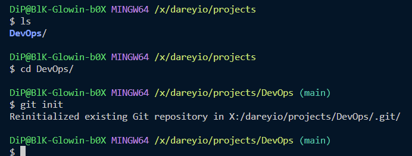
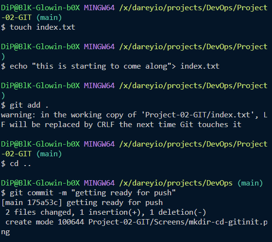
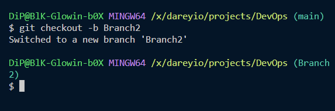
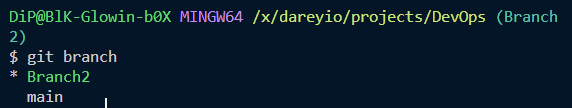
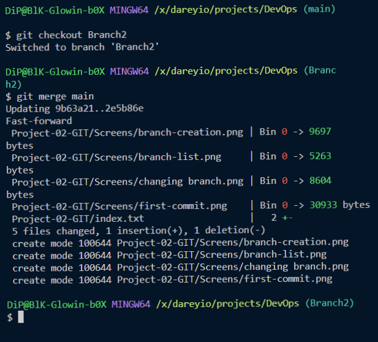
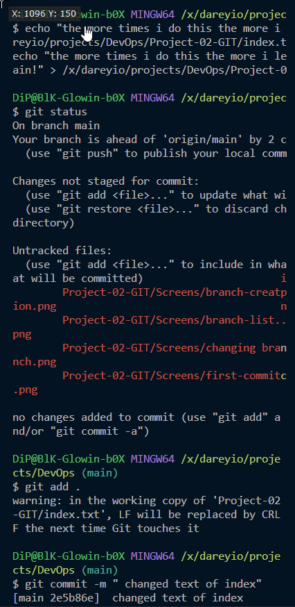
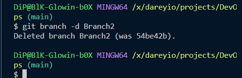

# **Welcome To My Git Project**

## ***Initializing and Commiting to Repository***

### **Initializing a Repository**

#### *Creating a working directory and initaializing*

#### *Making the first Commit*

### **Working with Branches**

#### *Creating the First Branch*

#### *Listing GIT Branches*

#### *Changing Between Branches*

#### *Merging Branches*

#### *Deletion of Branches*

## ***Collaboration and Remote Repositories***

### **Pushing local Repository to Remote Repository**

#### *Add a Remote Repository to the Local Repository*

#### *Pushing from Local Repository to Remote Repository*

#### *Cloning Remote Repository to Local*

## ***Branch Management and  Tagging***

### **Introduction to Markdown Syntax**

#### *The following are the most commonly used Markdawn Syntax elements*

### **1. Headings**

Putting a number of Hash symbols at the beginning of the line will create a heading.

Below are examples of this process
# Heading 1

'# Heading 1'
## Heading 2

'## Heading 2'
### Heading 3

'### Heading 3'

### **2. Emphasis**

asterics or underscore will create *Italic* or **Bold**

*italic* or _italic_
**bold** or __bold__
.png>)

### **3. Lists**

Markdown supports Unordered and orddered lists

#### unordered list example

- Item 1
- Item 2
- Item 3

#### ordered list example

1. First Item
2. Second Item
3. Third Item

### 4. **Links**

To insert a hyperlink use square brackets to surround clickable text followed by the url in parenthesies

[Click Here To Go to Link](r.mtdv.me/articles/DevOps)

### 5. **Images**

To display an image  use an ! followed by square brackets containing alt image description and parenthsis containing image location/URL

.png>)

### 6. **Code**

to display code snippits use backtics (') to enclose code to be displayed

`console.log('Welcome to darey.io')`

