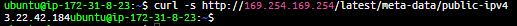
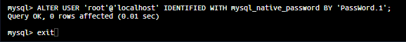
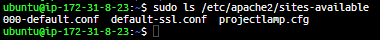

# **LAMP STACK IMPLAMENTATION**

*In this project, I have created a working linux environment,configured with Apache web server, MySQL databases, and writing PHP code for server functionality.*

## Instaling Apache

After starting an EC2 instance in AWS you must install Apache.

### *Installing Apache and Updating the Firewall*

#### To update the list of available packages use

    sudo apt update

#### Installing Apache2

    sudo apt install apache2

 To verify that apache2 is running correctly use the command

    sudo systemctl status apache2

To find the server public ip addressfrom the command line you can use the following command

    curl -s http://169.254.169.254/latest/meta-data/public-ipv4

To test the server on the command line insert

    curl http://localhost:80

Another way is to go to your internet browser of choice and insert the public ip address
When i went to the website this came up showing that apache was properly installed

## **Installing MySQL**

Once I was able to get the webserver running I installed a database management system.

To install MySQL i ran the command 

     sudo apt install mysql-server

Once the install was complete i then logged into the MySQL console by entering the command

    sudo mysql

From there the process to properly secure the SQL Shell is as follows:

Run security script that removes the default security settings and creates a custom configuration of the shell via the following commands

    ALTER USER 'root'@'localhost' IDENTIFIED WITH mysql_native_password BY 'PassWord.1';

 
    $ sudo mysql_secure_installation

Once the MySQL security has been updated i tested the settings by using the command
    sudo mysql -p

This was flagged with -p to prompt a password to log in

Type exit on the command line to leave the MySQL Console

## **Installing PHP**
PHP is installed to process code to allow the end user to see the content in a dynamic state rather than lines of code

### To create this I installed PHP and 2  nessicary modules

#### The first module allows PHP to communicate with MySQL databases

     php-mysql

#### The second module enables Apache to handle PHP files

    libapache2-mod-php

### Consolidation of Package Install

 Rather than installing each package  individually I opted to install with one line of code to save time

    sudo apt install php libapache2-mod-php php-mysql

Once the installation is complete you can verify the PHP version by typing the command 

    php -v

## **Creating a Virtual Host Using Apache**

### In this project I setup the domain as  ***projectlamp***

 Apache has one server block enabled by default that is configured to serve documents from the /var/www/html directory

 #### I left this  configuration and created my own directory next to the default
 
  I created this directory using the command
    
    sudo mkdir /var/www/projectlamp

 I then assigned ownership of this directory via 
    
    sudo chown -R  $USER:$USER /var/www/projectlamp

Finally I created and opened a new config file in Apache's sites-available directory using the vi command-line editor

    sudo vi /etc/apache2/sites-available/projectlamp.cfg

  

#### This created  a new blank file and opened it to allow editing

The following bare-bones configuration was then inserted by pressing the i key to enter insert mode

    <VirtualHost *:80>
        ServerName projectlamp
        ServerAlias www.projectlamp 
        ServerAdmin webmaster@localhost
        DocumentRoot /var/www/projectlamp
        ErrorLog ${APACHE_LOG_DIR}/error.log
        CustomLog ${APACHE_LOG_DIR}/access.log combined
    </VirtualHost>

 

To save and close the file follow the steps below

    1. Press the esc key
    2. Type :
    3. Type wq  (w is write q is quit)
    4. Press Enter

The following command will show the new file in the Sites-available directory

    sudo ls /etc/apache2/sites-available
 
 

To enable the newly configured virtual host input the following command

    sudo a2ensite projectlamp
    
  

To disable Apache default website  

    sudo a2dissite 000-default

  

To check for syntax errors in the configuration file  and to reload Apacheuse the following lines of code

    sudo apache2ctl configtest

    sudo systemctl reload apache2

To test the virtual host is properly working

 Create and index.html file in the web root /var/www/projectlamp 

     sudo echo 'Hello LAMP from hostname' $(curl -s http://169.254.169.254/latest/meta-data/public-hostname) 'with public IP' $(curl -s http://169.254.169.254/latest/meta-data/public-ipv4) > /var/www/projectlamp/index.html
  
 

## **Enable PHP on the Website**

The default Directory index settings of Apache create a presidence of index.html over index.php.
For website maintenence creating a temporary index.html file will direct end users to that over the actual index.php
After maintenence is finished the index.html is renamed or removed  allowing access to the regualr application page
### Editing Directory Index 
To change the Directory Index behavior  I changed the order in which the index.php file is listed using the following to open vim

       sudo vim /etc/apache2/mods-enabled/dir.conf

and to change the directory order

    <IfModule mod_dir.c>
        #Change this:
        #DirectoryIndex index.html index.cgi index.pl index.php index.xhtml index.htm
        #To this:
        DirectoryIndex index.php index.html index.cgi index.pl index.xhtml index.htm
    </IfModule>

Once this is complete Apache Must be reloaded for changes to take effect

A PHP test script was created and put into a newly created file "index.php" to confirm that Apache can handle and process PHP requests

File creation

    $ vim /var/www/projectlamp/index.php

File edit in vim

    <?php
    phpinfo();

Once finished save and close the file and refresh the webpage that had the Apache Default Page.

## **If this is what poped up upon refresh that means it has been done correctly**

It is best to remove this file that was created for security reasons

It is removed the following way

    $ sudo rm /var/www/projectlamp/index.php

