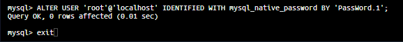
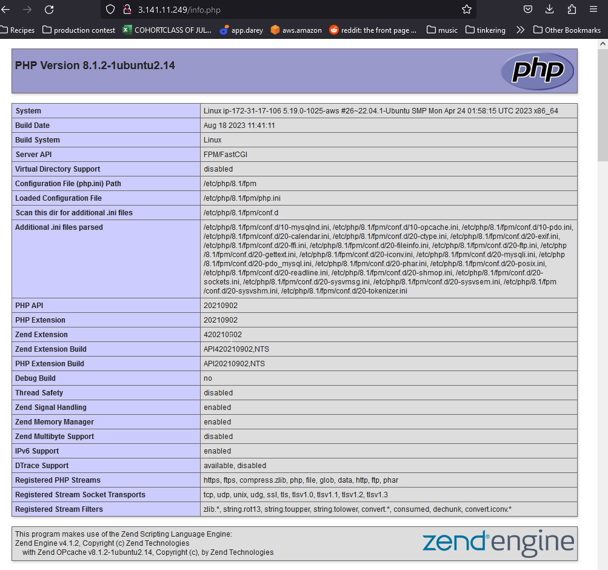
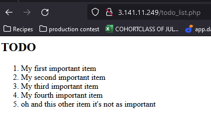

# **Web Stack Implementation-LEMP Stack**

*In this project, I have created a working linux environment,configured with Nginx web server, MySQL databases, and writing PHP code for server functionality.*

To start off I spun up an AWS ec2 instance with Ubuntu loaded on it
I then Connected via ssh

Once connected I was ready to begin populating the server with the needed packages

## **Installing the Nginx Web Server**

To install Nginx I first updated the package index

    sudo apt update

I then installed Nginx

    sudo apt install nginx

Once installed verify the installation by using the command

    sudo systemctl status nginx

After running the status check open port 80 via AWS (its usually open by default)

You can then run the following command to find the public ip without going to the AWS website

    curl -s http://169.254.169.254/latest/meta-data/public-ipv4

After that you can plug the ip  into the command line  to test how the Nginx server responds to requests from the outside world

    http://3.141.11.249:80

If Nginx is properly setup you will get the following screens in the terminal as well as if you input the ip in a web browser

## **Installing MySQL**

Just as in my LAMP Stack project to install MySQL you the command to use is

    sudo apt install mysql-server

When the install is complete run the command to log into MySQL

    sudo mysql

Once logged in to MySQL setting up a password for the root user is done by running the following command

    ALTER USER 'root'@'localhost' IDENTIFIED WITH mysql_native_password BY 'PassWord.1';

 once complete exit MySQL by typing the word exit in the command line

 To start the interactive pre-loaded security script run the command 

    $ sudo mysql_secure_installation

 Once ran you will be able to choose from  multiple variables of password security, removing anonymous users, remote root logins, and tests the database

 

 When I finished setting up my password i tested it by logging into MySQL 

     Sudo mysql -p

  the -p flag to prompt for password input 

Just as before type exit in the command line to exit  the MySQL console

## **Installing PHP**

As with previous package installs using the sudo apt install  command line install PHP

However this time I combined multiple package  installs into one command prompt

    sudo apt install php-fpm php-mysql

## **Configuring Nginx to use PHP Processor**

Like Apache Nginx creates blocks to keep configuration details and host more than one domain on a server

I am using the domain name projectLEMP for this project domain name

To begin setting up first create the root web directory

    sudo mkdir /var/www/projectLEMP

When this is complete I assigned the ownership of the directory using the command

    sudo chown -R $USER:$USER /var/www/projectLEMP

I then created and opened a blank file using nano as a command line editor

    sudo nano /etc/nginx/sites-available/projectLEMP

Once this was opened in nano i proceeded to put in the bare-bones configuration shown in the following image

Next was to activate and test my configuration by linking to the config file with

    sudo ln -s /etc/nginx/sites-available/projectLEMP /etc/nginx/sites-enabled/

Afterwords

- I tested

        sudo nginx -t

- Disabled the Nginx default host

        sudo unlink /etc/nginx/sites-enabled/default

- Reloaded Nginx

         sudo nginx -t

To test the output of the server block i created an index file and populated it with text and looked at the web page in my web browser

    sudo echo 'Hello LEMP from hostname' $(curl -s http://169.254.169.254/latest/meta-data/public-hostname) 'with public IP' $(curl -s http://169.254.169.254/latest/meta-data/public-ipv4) > /var/www/projectLEMP/index.html

## **Testing PHP with Nginx**

At this point my Project LEMP Stack is completely setup and the LAMP Stack is installed and operational

To test this I created a PHP test file  with the following PHP code to return server information

    - nano /var/www/projectLEMP/info.php

    -  <?php
        phpinfo();

Once complete go to your web browser and input the public ip /info.php and if done correctly you will get the following information screen

After checking the information it is good practice to remove this file, due to sensitive information available on it, By using the following command

    sudo rm /var/www/your_domain/info.php

## **Retrieving data from MySQL database with PHP**

For this section of the project I created a test database and test user.

To do this i connected to the MySQL console via 

    sudo mysql

To create my first database, so aptly named DiPabase, I used the command

    CREATE DATABASE DiPabase;

To be able to make changes  to the database I created a new user and granted permissions
as seen in the previous image using the commands

    mysql>  CREATE USER 'Thatguy'@'%' IDENTIFIED WITH mysql_native_password BY 'PassWord.1';

    mysql> GRANT ALL ON DiPabasee.* TO 'Thatguy'@'%';

Once complete exit the MySQL console via 'exit' on the command line

Test the new permissions again log into MySQL console
but this time use teh user and password flags

    sudo mysql -u Thatguy -p password

After logging into the SQL console to view the databases use the command 

    SHOW DATABASES;

I created a table and named it todo_list busing the command

    CREATE TABLE example_database.todo_list (item_id INT AUTO_INCREMENT,content VARCHAR(255),PRIMARY KEY(item_id));

I then inserted a few rows  into the test table by entering the following  edited command multiple times whilst changing values for different outputs

    INSERT INTO example_database.todo_list (content) VALUES ("My first important item");

After the list was created to confirm that the data was saved successfully i used the command

    SELECT * FROM example_database.todo_list;

The output from the previous few steps are displayed in the image below

I created a PHP script that connects to MySQL and query's for my content

For this I used 

    sudo nano /var/www/projectLEMP/todo_list.php

And then copied and edited some text areas for my personal settings from the following

    <?php
    $user = "example_user";
    $password = "PassWord.1";
    $database = "example_database";
    $table = "todo_list";

    try {
        $db = new PDO("mysql:host=localhost;dbname=$database", $user, $password);
        echo "<h2>TODO</h2><ol>";
        foreach($db->query("SELECT content FROM $table") as $row) {
        echo "<li>" . $row['content'] . "</li>";
        }
         echo "</ol>";
    } catch (PDOException $e) {
           print "Error!: " . $e->getMessage() . " ";
           die();
    }

Once it was edited and complete i saved and closed, I was able to  go back to my web browser and type in the web address followed by

    /todo_list.php

And the result was  the following image

