# This my [Darey.io](https://darey.io/)**SHELL SCRIPTING** Project

## Intro to Shell Scripting Project

In this project I learned that shell scripts are a series of bash commands and instructions that are preformed in sequential order in a shell to handle repetitive tasks. These scripts are written and stored in text files with the .sh extension.

### **Shell Scripting Syntax Elements**

#### 1. Variables: 

    stored data types such as numbers, strings, and arrays

Values can be assigned to a variable by using the (=) operator
they can be called upon using the variable name with the $ sign before it.

    name="John" 
    echo $name

#### 2. Control Flow:

    Flow statements like if-else,for loops, while loops, and case statements allow  decision making, list iteration, and execute commands based on conditions

Example script to check if a number is positive, negative, or zero

    read -p "Enter a number: " num

    if [ $num -gt 0 ]; then
        echo "The number is positive."
    elif [ $num -lt 0 ]; then
        echo "The number is negative."
    else
        echo "The number is zero."
    fi

    #!/bin/bash

Example script to print numbers from 1 to 5 using a for loop

    for (( i=1; i<=5; i++ ))
    do
        echo $i
    done

 Example script to print numbers from 1 to 5 using a for loop

    for (( i=1; i<=5; i++ ))
    do
        echo $i
    done

#### 3. Command Substitution:

    Allows the capture of output of a command to be used within the script

     A backtick or the $() syntax command substitutions

Examples of this

    current_date=`date +%Y-%m-%d`

    current_date=$(date +%Y-%m-%d)

#### 4. Input & Output:

    The read command can be used to accept user input and output to text using the echo command.

    Using operators such as:
     > (outputs to a file)
     < (input from a file)
     | (pipes the output from one command as the input to another command)

Example of this are

    echo "Enter your name:"
    read name

    echo "Hello World"

    echo "hello world" > index.txt

    grep "pattern" < input.txt

    echo "hello world" | grep "pattern"

#### 5. Functions:

    Functions allow you to define and group related commands together, make your code reuseable

Example of this are

Define a function to greet the user
  
    greet() {
    echo "Hello, $1! Nice to meet you."
    }

Call the greet function and pass the name as an argument

    greet "John"

## **My First Shell Script**

### The following images and code was written by me following the lesson plan.

#### Creating a new directory

    mkdir shell-scripting
 
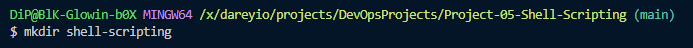

#### Creating shell-script.sh file

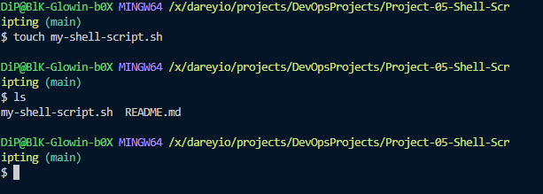

#### Creating and writing the code for user-input.sh 

    For this i used nano to create and open the file editor to save time rather than using touch command

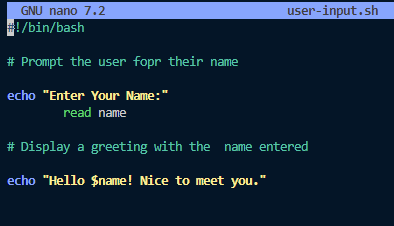

*I then saved the file by exiting and saving via nano.*

#### To properly run the shell script I used the following command to make the file executable

    sudo chmod +x user-input.sk

#### To run the script I used the following command 

    ./user-input.sh

This achieved the following result

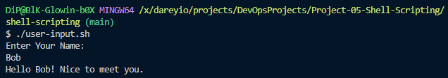

## Directory Manipulation & Navigation

For this part of the project I created a file named navigating-linux-filesystem.sh
and input the code in the following image

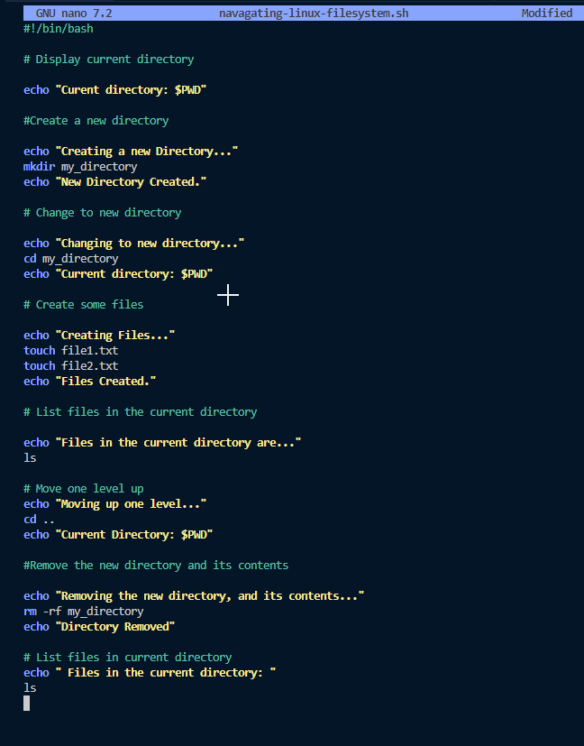

This script when ran correctly will create a new directory, change to the created directory,and create two files. 
The script will then move up a directory, and remove the created directory and its contents, then it will list the files in the current directory.

Before i  was able to run the script I used the following command to allow it to be executable

    chmod +x navigating-linux-filesystem.sh

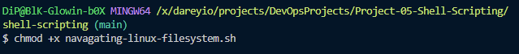

Once complete to run the created script i used the command 

    ./navigating-linux-filesystem.sh

The following image shows the output put of the script

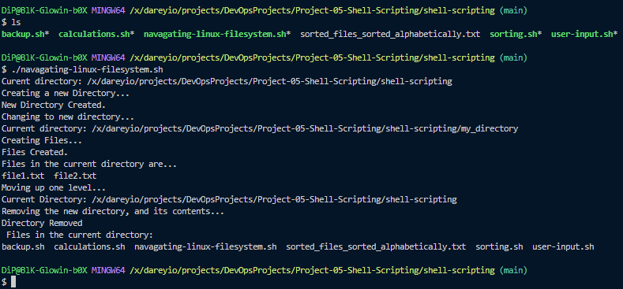

## File Operations & Sorting

This portion of the project I created a script that created and sorted files, displayed the files in their current order. It then sorted the files alphabetically, created a .txt file that the sorted files are put into,the original files are then deleted, the .txt file is renamed and the contents are displayed.

 I used nano in the first step of this portion to create a new file and input the code that will become the script.

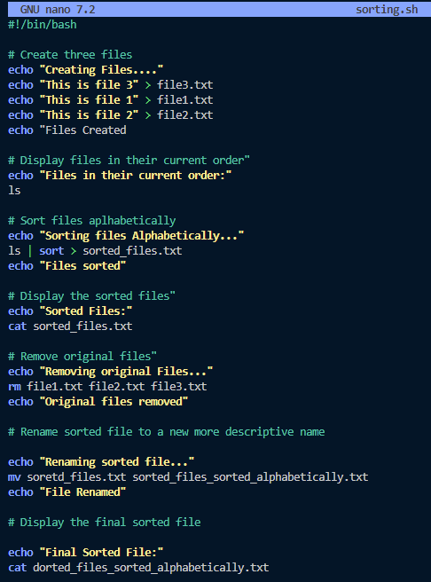

After the code was input and the file was saved I ran the command 

    chmod +x sorting.sh

This allowed me to make the script executable and the following image is the output of running the script via 

    ./sorting.sh

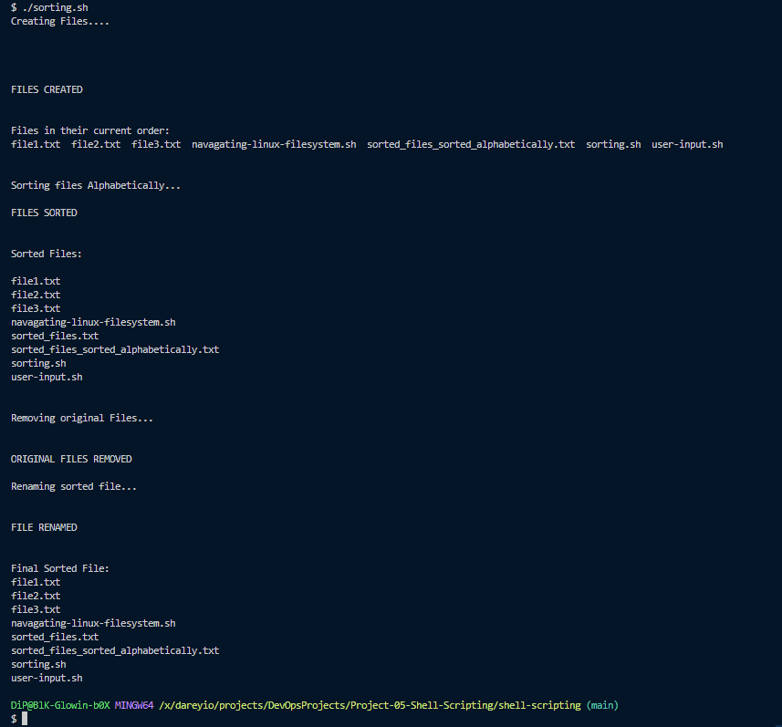

## Working with Numbers & Calculations

This section of the project I created a script, named calculations, that defined two numerical variables.These variables then were used to preform basic arithmetic, as well as more complex calculations.

The first step was to create a new file and populate the code within which Ii again used the nano editor.

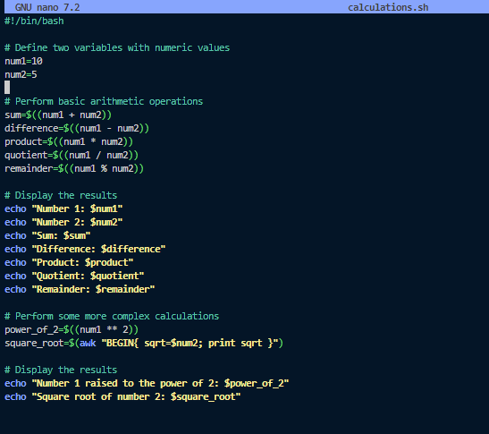

After that was complete I again used the made the file executable using the command

    chmod +x 

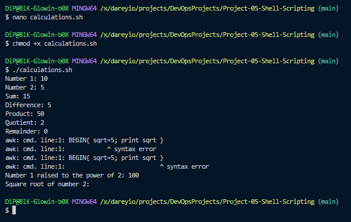

When complete I ran the script via 

    ./calculations.sh

The output is as follows

## File Backup & Timestamp

For the final part of the project a backup script file was created, populated, and made executable.

The script itself defines the source directory and paths, it then creates a timestamp using the current date and time, and finally creates and copies teh directory/files to a backup file in the directory of choice.

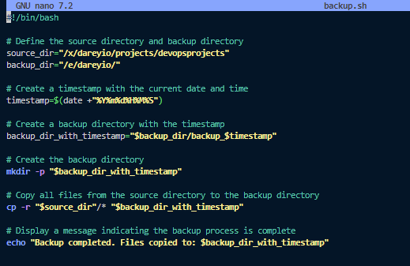
 
This is the output of the backup.sh script

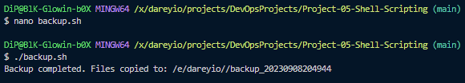
