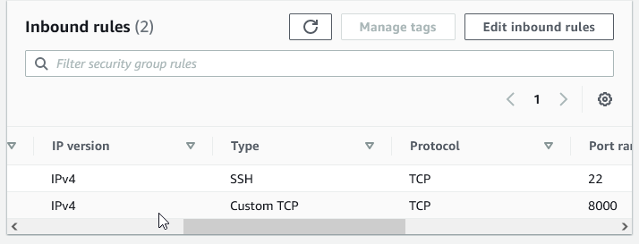

# **Automating  Configuration of Webservers & Loadbalancing using Shell Scripts**

In this project I demonstrated the use of shell scripts to auto mate the setup and maintenance of a load balancer using a freestyle job  that results in enhanced efficiency, and a reduction of manual efforts

## **Deployment and Configuration of Webservers**

The first step  of this project was to create 3 ec2 instances.
 2 of which would become webservers and the remaining would become an nginx load balancer

 The second stem was to create an inbound rule for the webserver instances allowing communication via port 8000

 

Once the inbound rules were created, I connected to the instances via SSh.

used nano to crate, and open, and edit the text a file I named install.sh

Once I created the file install.sh I input the following code that would become my apache installation script.

        #!/bin/bash

    ####################################################################################################################
    ##### This automates the installation and configuring of apache webserver to listen on port 8000
    ##### Usage: Call the script and pass in the Public_IP of   your EC2 instance as the first argument as shown below:
    ######## ./install_configure_apache.sh 127.0.0.1
    ##############################################################  ######################################################

    set -x # debug mode
    set -e # exit the script if there is an error
    set -o pipefail # exit the script when there is a pipe failure

    PUBLIC_IP=$1

    [ -z "${PUBLIC_IP}" ] && echo "Please pass the public IP of your EC2 instance as an argument to the script" && exit 1

    sudo apt update -y &&  sudo apt install apache2 -y

    sudo systemctl status apache2

    if [[ $? -eq 0 ]]; then
        sudo chmod 777 /etc/apache2/ports.conf
        echo "Listen 8000" >> /etc/apache2/ports.conf
     sudo chmod 777 -R /etc/apache2/

        sudo sed -i 's/<VirtualHost \*:80>/<VirtualHost *:8000>/' /etc/apache2/sites-available/000-default.conf

    fi
    sudo chmod 777 -R /var/www/
    echo "<!DOCTYPE html>
        <html>
        <head>
            <title>My EC2 Instance</title>
        </head>
        <body>
            <h1>Welcome to my EC2 instance</h1>
            
Public IP: "${PUBLIC_IP}"

        </body>
        </html>" > /var/www/html/index.html

    sudo systemctl restart apache2

.png>)

Once the file was saved I then changed the permissions of the file on the webservers using the command 

    sudo chmod +x install.sh

To run the script the following command followed by the public ip of the webserver being configured.

     ./install.sh Public_IP

## **Deployment and configuration of Nginx Loadbalancer**

To setup the third Ec2 Instance I  created an inbound rule to allow communication over port 80

I then connected to the instance via SSH.

Created, and opened the file using the nano editor

Once the nginx.sh file was created and the editor was entered, I created the script  using the code below and inputting the proper webserver, and loadbalancer public ip addresses were needed to be defined
    
    #!/bin/bash

    ######################################################################################################################
    ##### This automates the configuration of Nginx to act as a load balancer
    ##### Usage: The script is called with 3 command line arguments. The public IP of the EC2 instance where Nginx is installed
    ##### the webserver urls for which the load balancer distributes traffic. An example of how to call the script is shown below:
    ##### ./configure_nginx_loadbalancer.sh PUBLIC_IP Webserver-1 Webserver-2
    #####  ./configure_nginx_loadbalancer.sh 127.0.0.1 192.2.4.6:8000  192.32.5.8:8000
    ############################################################################################################# 

    PUBLIC_IP=$1
    firstWebserver=$2
    secondWebserver=$3

    [ -z "${PUBLIC_IP}" ] && echo "Please pass the Public IP of your EC2 instance as the argument to the script" && exit 1

    [ -z "${firstWebserver}" ] && echo "Please pass the Public IP together with its port number in this format: 127.0.0.1:8000 as the second argument to the script" && exit 1

    [ -z "${secondWebserver}" ] && echo "Please pass the Public IP together with its port number in this format: 127.0.0.1:8000 as the third argument to the script" && exit 1

    set -x # debug mode
    set -e # exit the script if there is an error
    set -o pipefail # exit the script when there is a pipe failure

    sudo apt update -y && sudo apt install nginx -y
    sudo systemctl status nginx

    if [[ $? -eq 0 ]]; then
        sudo touch /etc/nginx/conf.d/loadbalancer.conf

        sudo chmod 777 /etc/nginx/conf.d/loadbalancer.conf
        sudo chmod 777 -R /etc/nginx/

    
     echo " upstream backend_servers {

            # your are to replace the public IP and Port to that of your webservers
            server  "${firstWebserver}"; # public IP and port for webserver 1
            server "${secondWebserver}"; # public IP and port for webserver 2

            }

           server {
            listen 80;
            server_name "${PUBLIC_IP}";

            location / {
                proxy_pass http://backend_servers;   
            }
        } " > /etc/nginx/conf.d/loadbalancer.conf
    fi

    sudo nginx -t

    sudo systemctl restart nginx

Once the script was completed, edited, saved , and the editor was closed I then changed permission of the file to allow the script to be ran properly  by 

    sudo chmod +x nginx.sh

Deploying the loadbalancer configuration script is done by  calling the script followed by the public ip and port of the loadbalancer and webserver.

    ./nginx.sh PUBLIC_IP Webserver-1 Webserver-2

If all was done correctly you can verify by inputting the webservers public ip into a web browser and it should show  as follows.

To test that the load balancer is properly setup input the loadbalancer public ip into the web address bar and it will load a different one of the created webservers with each new connection.

