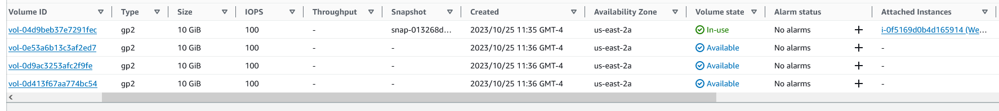
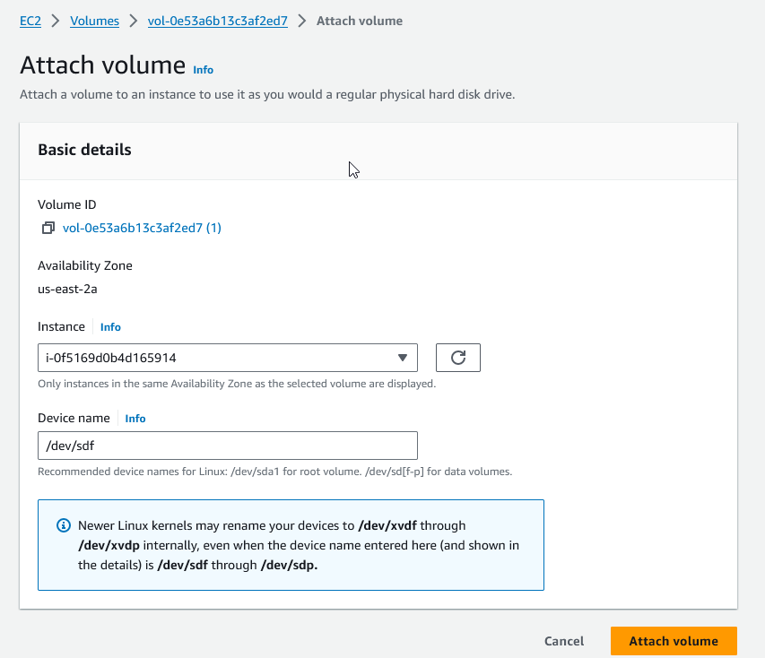
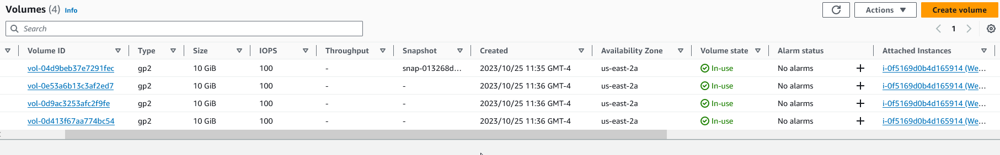
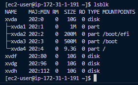
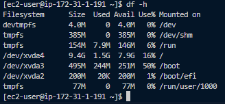
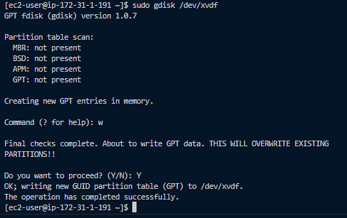

# **This Project is In Progress**

# **Implementing Wordpress Website with LVM Storage Management**

In this project I will be creating a scalable  WordPress website using AWS EC2 and Logical Volume Management (LVM) storage.

The site will be *ThreeTier Architecture*

    Client-server software architecture pattern that consists of 3 separate layers

        1. Presentation Layer (PL):
            The use interface as the client server / browser
        2. Business Layer (BL):
            Backend program that implements business logic. Application / Webserver
        3. Data Access / Management Layer (DAL):
            Computer data storage / data access layer consisting of Database Server / File System Server.
            such as FTP Server or NFS Server

 This will be demonstrated by

        1. Configuring storage subsystems for the Web & Database servers based on Linux OS. 

        2. Installing WordPress and connecting it to a remote MySQL database server.

## **Implementing LVM on Linux (Web & Database) Servers**

I launched an EC2 instance loaded with Redhat that will serve as the Web Server. Created 3 EBS Volumes with 10 GiB of space and attached to the running instance.

 To create the volumes i selected Volumes under the AWS dropdown Elastic Block Store -> create volume -> adjusted to the size needed-? made sure it was in the same availability zone as the instance-> selected create volume.

To attach the volumes, one at a time, to an instance I selected the volume -> went to actions-> selected attach volume -> chose the instance to attach to.

I then connected to the webserver via ssh.

Once connected via ssh I checked what block devices were attached to the server. by using the command.

    lsblk

The 3 volumes that were created and attached were named xvdf, xvdh, xvdg.

The command

    df -h

Shows all mounts and free space on the server

To create a single partition on the 3 disks I used gdisk

    sudo gdisk /dev/xvdf

