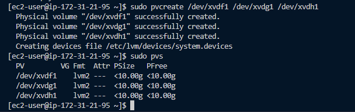
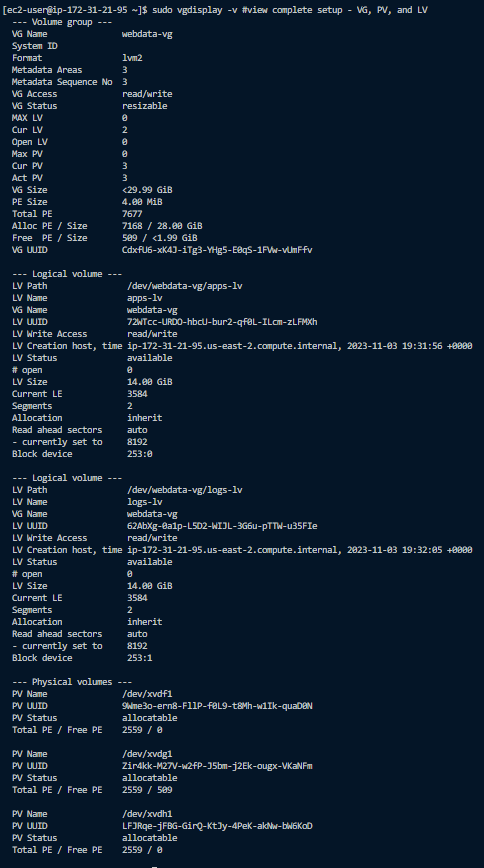
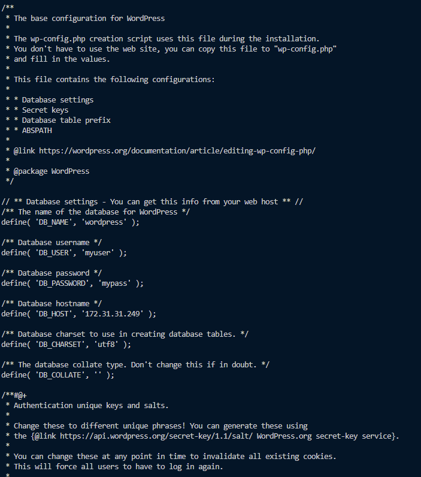

# **This Project is In Progress**

# **Implementing Wordpress Website with LVM Storage Management**

## In this project I will be creating a scalable  WordPress website using AWS EC2 and Logical Volume Management (LVM) storage.

### **Preparing the Web Server**

The site will be *ThreeTier Architecture*

    Client-server software architecture pattern that consists of 3 separate layers

        1. Presentation Layer (PL):
            The use interface as the client server / browser
        2. Business Layer (BL):
            Backend program that implements business logic. Application / Webserver
        3. Data Access / Management Layer (DAL):
            Computer data storage / data access layer consisting of Database Server / File System Server.
            such as FTP Server or NFS Server

 This will be demonstrated by

        1. Configuring storage subsystems for the Web & Database servers based on Linux OS. 

        2. Installing WordPress and connecting it to a remote MySQL database server.

## **Implementing LVM on Linux (Web & Database) Servers**

I launched an EC2 instance loaded with Redhat that will serve as the Web Server. Created 3 EBS Volumes with 10 GiB of space and attached to the running instance.

 To create the volumes i selected Volumes under the AWS dropdown Elastic Block Store -> create volume -> adjusted to the size needed-? made sure it was in the same availability zone as the instance-> selected create volume.

To attach the volumes, one at a time, to an instance I selected the volume -> went to actions-> selected attach volume -> chose the instance to attach to.

I then connected to the webserver via ssh.

Once connected via ssh I checked what block devices were attached to the server. by using the command.

    lsblk

The 3 volumes that were created and attached were named xvdf, xvdh, xvdg.

The command

    df -h

Shows all mounts and free space on the server

To create a single partition on the 3 disks I used gdisk

    sudo gdisk /dev/xvdf

    sudo gdisk /dev/xvdg

    sudo gdisk /dev/xvdh

To check the partitioned disks I once again used the command

    lsblk

I installed lvm2 and ran sudo lvmdiskscan to check for available partitions

To create a volume group of the 3 physical volumes installed I used pvcreate 

    sudo pvcreate /dev/xvdh1 /dev/xvdg1 /dev/xvdf1

Once the Physical Volumes (PV) were createdI verified by using the command

    sudo pvs

To create a Volume Group (VG) I used the *vgcreate* utility to add the 3 PVs. This group was named webdata-vg and created by using 

    sudo vgcreate webdata-vg /dev/xvdf1 /dev/xvdg1 /dev/xvdh1 

Once the VG was created it was verified by inputting

    sudo vgs

After the volumes were created and verified, I created 2 logical volumes (LV). These logical volumes are apps-lv (one half of the PV in size) , and logs-lv ( the remaining space of the PV was used)

    sudo lvcreate -n apps-lv -L 14G webdata-vg
    sudo lvcreate -n logs-lv -L 14G webdata-vg

To verify the entire creation and setup of the physical and logical volumes, partitions i used the command 

    sudo vgdisplay -v #view complete setup - VG, PV, and LV
    sudo lsblk 

I then formatted the logical volumes with the ext4 filesystem

To do this the commands used are

    sudo mkfs -t ext4 /dev/webdata-vg/apps-lv
    sudo mkfs -t ext4 /dev/webdata-vg/logs-lv

Once the volumes were set and formatted an html directory was created to store the website files

    sudo mkdir -p /var/www/html

Another directory was also created to stre backups of log data

    sudo mkdir -p /home/recovery/logs

The directory /var/www/html was then mounted on the apps-lv Logical Volume

    sudo mount /dev/webdata-vg/apps-lv /var/www/html/

Next was to mount the recovery log storage onto the logs-lv Logical Volume

BEFORE mounting this directory it MUST be backed up using the *rsync* utility via

    sudo rsync -av /var/log/. /home/recovery/logs/

Once mounted the existing data on /var/log will be deleted! Hence the previous backup of that location.

Mounting of /var/log on logs-lv is done by usig the command

    sudo mount /dev/webdata-vg/logs-lv /var/log

Restoring the backup of the var/log directory is done via

    sudo rsync -av /home/recovery/logs/. /var/log

To set the mount configuration to reload after a server restart the /etc/fstab file must be updated by using the UUID of the device.

This is aquired by using

    sudo blkid

Once the UUID is found for the devices it needs to be added to the /etc/fstab file using vi

Time to test the configuration, reload the daemon and verify the completed setup!

    sudo mount -a

    sudo systemctl daemon-reload

    df -h

## **Installing WordPress** and *Configuring MySQL Database*

### **PREPARING THE DB SERVER**

To start the process for the database server, I created another Redhat EC2 Instance, as well as 3 more 10 GiB Volumes, and attached them just as before

Connection:

Update of server:

I checked for the volumes by using
    lsblk

I then created partitions on each of the volumes

    sudo gdisk /dev/xvdf

    sudo gdisk /dev/xvdg
    
    sudo gdisk /dev/xvdh

To check for available partitions I installed lvm2 and scanned the disk

    sudo lvmdiscscan

I used pvcreate utility to mark the disks as Physical Volumes and used sudo pvs to verify their creation

    sudo pvcreate /dev/xvdf1

    sudo pvcreate /dev/xvdg1
    
    sudo pvcreate /dev/xvdh1

Once Verified I created and verified a Volume Group

    sudo lvcreate -n db-lv -L 29G database-vg
    
    sudo lvs

When mounted and the /etc/fstab was configured the daemon was reloaded and the setup was verified

### **INSTALLING WORDPRESS ON THE WEBSERVER**

Once the database was setup I went back to the webserver. There I updated the repository, Installed wget, Apache, as well as Apache dependancies.

    sudo yum update -y

    sudo yum install wget -y
    
    sudo yum install httpd -y

    sudo yum install php -y

    sudo yum install php-mysqlnd -y

    sudo yum install php-fpm -y

    sudo yum install php-json -y

Once installed I enabled and started the Apache (httpd) service

    sudo systemctl enable httpd

### **INSTALLING MYSQL ON DB SERVER**

To install PHP and it's dependancies I used the following procedure.

    sudo yum install https://dl.fedoraproject.org/pub/epel/epel-release-latest-8.noarch.rpm
    

    sudo yum install yum-utils http://rpms.remirepo.net/enterprise/remi-release-8.rpm

    sudo yum module list php
    

    sudo yum module reset php

    
    sudo yum module enable php:remi-7.4
 
    sudo yum install php php-opcache php-gd php-curl php-mysqlnd

    
    sudo systemctl start php-fpm
    
    sudo systemctl enable php-fpm
    
    sudo setsebool -P httpd_execmem 1

Once installed I restarted httpd and verified its status

Next was to download and copy wordpress to the  location /var/www/html

This was done by the following:

    mkdir wordpress
    cd   wordpress
    sudo wget http://wordpress.org/latest.tar.gz
    sudo tar xzvf latest.tar.gz
    sudo rm -rf latest.tar.gz
    sudo cp wordpress/wp-config-sample.php wordpress/wp-config.php
    sudo cp -R wordpress /var/www/html/

Configuring SELinux Policies

    sudo chown -R apache:apache /var/www/html/wordpress
    sudo chcon -t httpd_sys_rw_content_t /var/www/html/wordpress -R
    sudo setsebool -P httpd_can_network_connect=1

## **Installing MySQL on Database Server**

I started by updating, then I installed mysql-server 

    sudo apt insstall mysql-server -y

    

Once installed i checked the status of mysqld, it wasnt running, and was disabled.

I restarterd  mysqld, enabled , and checked its status once again to verify it was running correctly.

## **Configuring DB to work with Wordpress**

To configure the installed MySQL database I logged into MySQL, created the wordpress database, created a user and password, and granted permissions to access the database remotely.

    sudo mysql
        
        CREATE DATABASE wordpress;
        
        CREATE USER `myuser`@`<Web-Server-Private-IP-Address>` IDENTIFIED BY 'mypass';
        
        GRANT ALL ON wordpress.* TO 'myuser'@'<Web-Server-Private-IP-Address>';
        
        FLUSH PRIVILEGES;
        
        SHOW DATABASES;

    exit

Once completed I went and changed the instance inbound rules to ONLY allow access to the Database serverfrom the wordpress webserver on port 3306 

## **Configuring WordPress for Remote Connection to Database**

To connect to the database from the webserver I installed and tested the connectivity of mysql-client

    sudo mysql -u myuser -p -h 172.31.31.249
    
    SHOW DATABASES; 

Once this was connecting via the command line I went into the wp-config file located in /var/www/html/wordpress and edited its contents to allow connection to the database

I then opened traffic from anywhere on port 80  via an inbound rule change on the webserver ec2 instance.

Once all was comleted I went to my webbrowser, input the public ip of the webserver ec2 followed bt /wordpress and the results are as follows

