# DEVOPS TOOLING WEBSITE SOLUTION

## In this project a tooling website is designed to store the commonly used tools in Devops using the following components

    Infrastructure : 
        AWS

    Webserver : 
        RHEL-8.6

    Database Server : 
        Ubuntu 20.04 &  MySQL

    Storage Server :
        RHEL-8.6 Network File System (NFS) Server

    Programming Language : 
        PHP

    Code Repository : 
        GitHub

## IMPLAMENTATION

## The backend storage server being used in this project is setup as a NFS Server

### Below are the steps to creating the NFS Server :

    Create AWS Instance
    Create & Attach Volumes
    Setup the server
    Configure the NFS Server to be accessible to the Webservers
 
## **1. Prepare the NFS Server**

- I spun up a new EC2 Instance loaded with a  specific RHEL 8.6.0 ami

     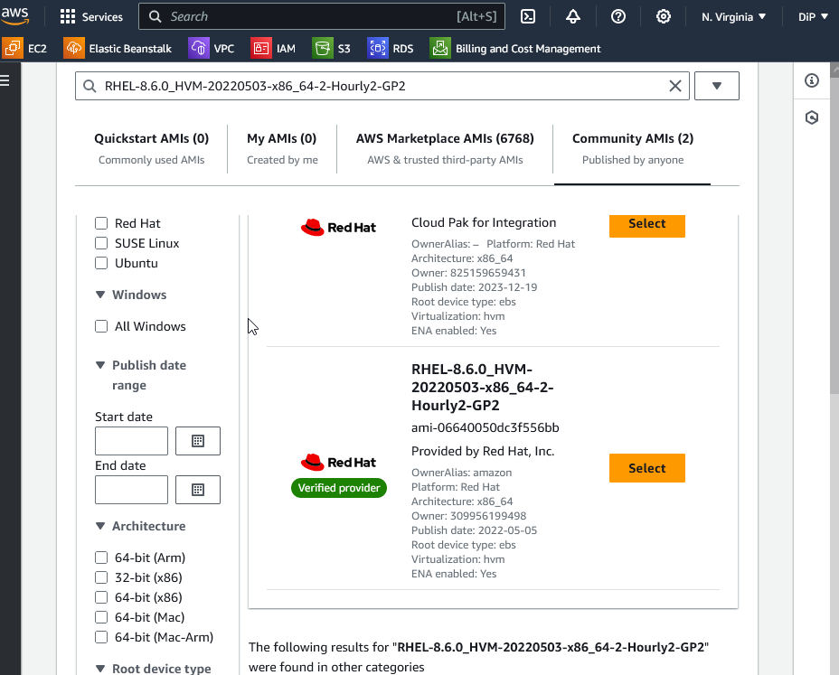

- Creation & attachment of 3 volumes fou use by NFS Server

    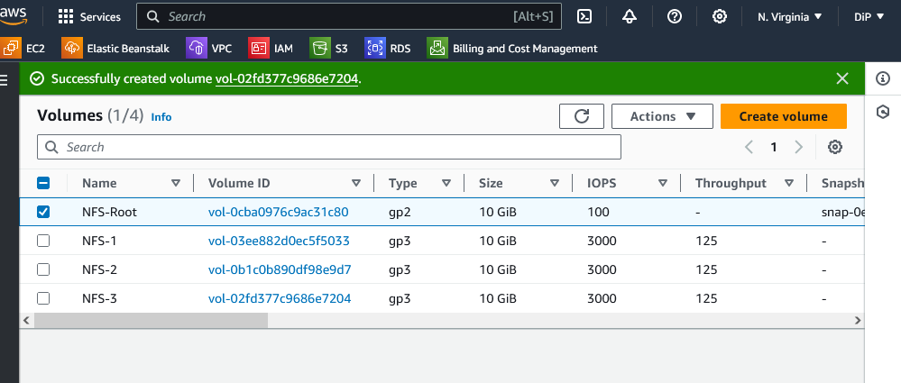

    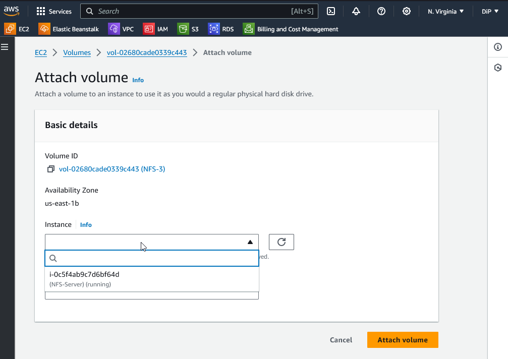

- Connection  via ssh, to confirm volume availability

        lsblk

        df-h

     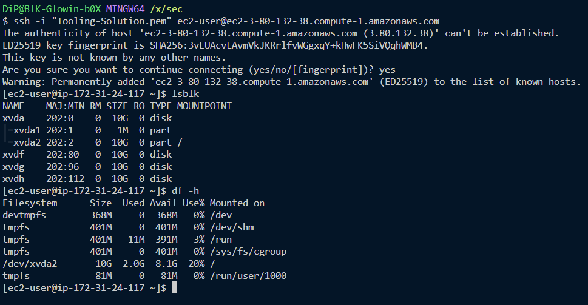

### **Configuring LVM on NFS Server**

 - Partitioning :

    **Using ***gdisk*** utility :**

        sudo gdisk /dev/xvdf 

    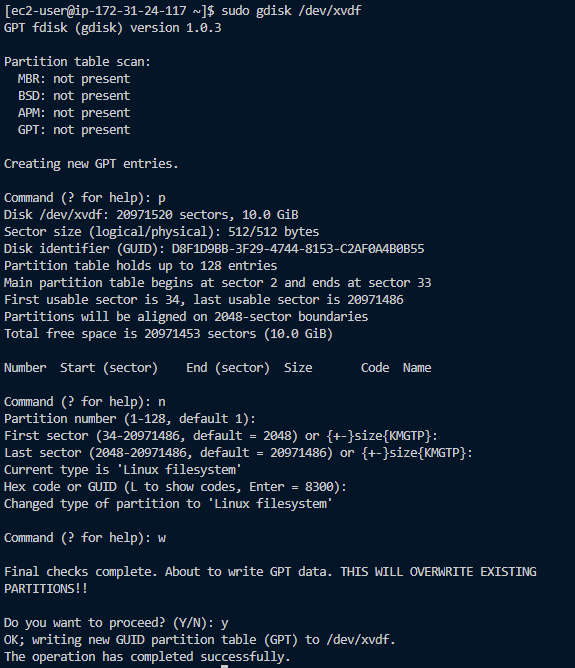

        sudo gdisk /dev/xvdg

    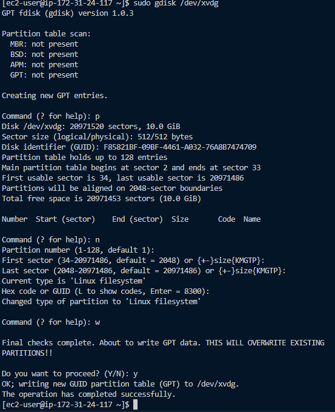

        sudo gdisk /dev/xvdh

    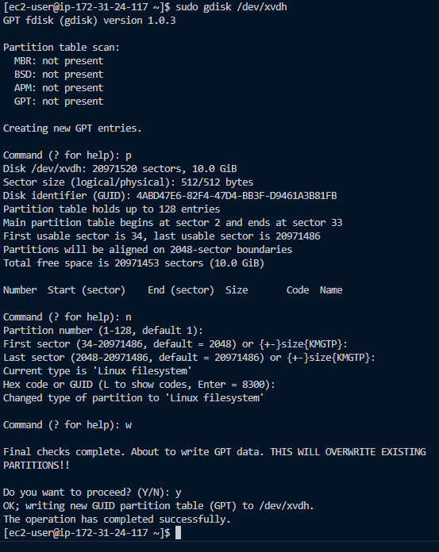

 - Install lvm2 package :

        sudo yum install lvm2 -y

    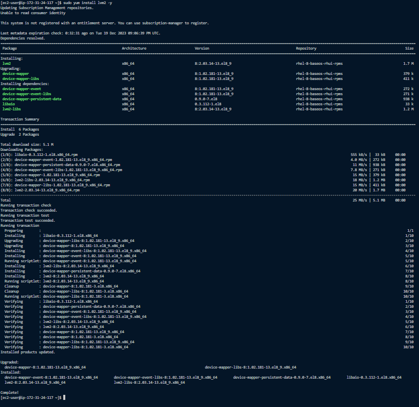

 - Using pvcreate to create physical volumes on the partitions
        
        sudo pvcreate /dev/xvdf1
        
        sudo pvcreate /dev/xvdg1

        sudo pvcreate /dev/xvdh1

    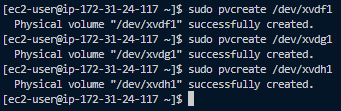

 - Using vgcreate to construct a Volume Group 'webdata'

        sudo vgcreate webdata-vg /dev/xvdf1 /dev/xvdg1 /dev/xvdh1

    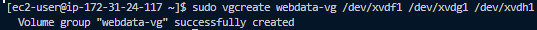

 - Using lvcreate to make Logical Volumes, apps, logs, opt

        sudo lvcreate -n lv-apps -L 9GiB webdata-vg

        sudo lvcreate -n lv-logs -L 9GiB webdata-vg

        sudo lvcreate -n lv-opt -L 9GiB webdata-vg

    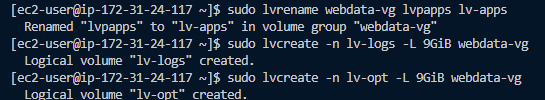

    Verification of  PV,VG,LV Creation :

    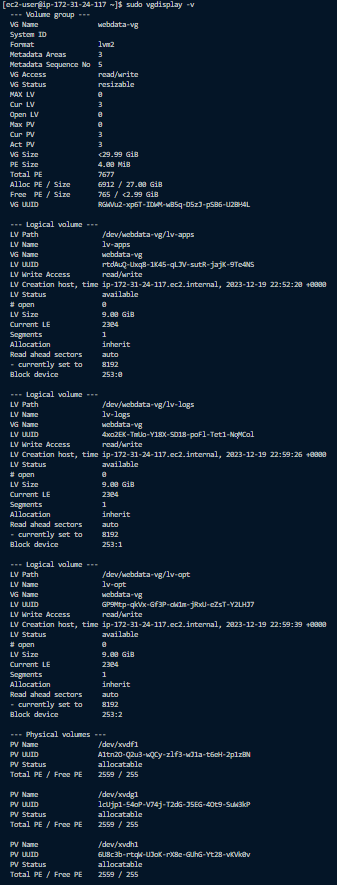

 - Formatting 
    
    MKSF Utility is used to format the disks to xfs

        sudo mkfs -t xfs /dev/webdata-vg/lv-apps

        sudo mkfs -t xfs /dev/webdata-vg/lv-logs

        sudo mkfs -t xfs /dev/webdata-vg/lv-opt
        
    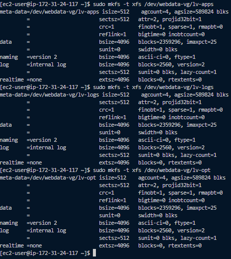

 - Create mount points and mounting of the logical volumes

     lv-apps -> /mnt/apps : 
to be used by webservers
    
            sudo mkdir /mnt/apps
            sudo mount /dev/webdata-vg/lv-apps /mnt/apps

     lv-logs -> /mnt/logs : to be used by webserver logs

            sudo mkdir /mnt/logs
            sudo mount /dev/webdata-vg/lv-logs /mnt/logs

     lv-opt -> /mnt/opt : to be used by Jenkins in a future project

            sudo mkdir /mnt/opt
            sudo mount /dev/webdata-vg/lv-opt /mnt/opt

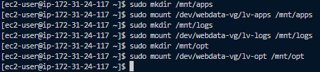

### **Install NFS Server**

- Install

        sudo yum update -y
        sudo yum install nfs-utils -y

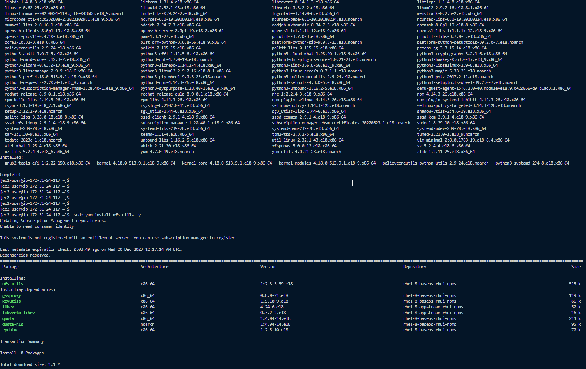

- Configure to start on reboot

        sudo systemctl start nfs-server.service

        sudo enable nfs-server.service

- Verify the server is up and running

        sudo systemctl status nfs-server.service
        
    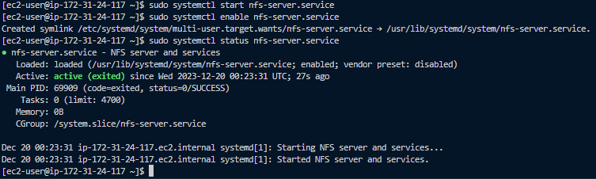

### **Exporting Mounts for webservers on Subnet**

 - Setting Permissions to webservers for read, write, execute of NSF files

        sudo chown -R nobody: /mnt/apps
        sudo chown -R nobody: /mnt/logs
        sudo chown -R nobody: /mnt/opt

        sudo chmod -R 777 /mnt/apps
        sudo chmod -R 777 /mnt/logs
        sudo chmod -R 777 /mnt/opt

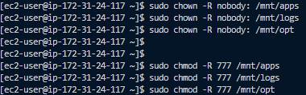

 - Restart NFS Server Services

        sudo systemctl restart nfs-server.service

        sudo systemctl status nfs-server.service

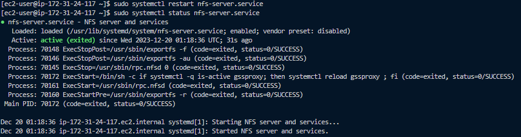

 - Configure client access of NFS on subnet CIDR - 172.31.16.0/20
    
        sudo vi /etc/exports

             /mnt/apps 172.31.16.0/20(rw,sync,no_all_squash,no_root_squash)

            /mnt/logs 172.31.16.0/20(rw,sync,no_all_squash,no_root_squash)

            /mnt/opt 172.31.16.0/20(rw,sync,no_all_squash,no_root_squash)

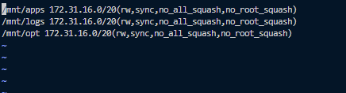

        sudo exportfs -arv    

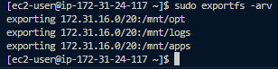

 - Check ports used by NFS and create new inbound rules  for EC2 Security Group

        rpcinfo -p | grep nfs

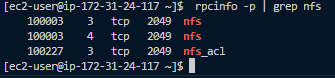

***IMPORTANT NOTE :***

For the NFS server to be accessable from the client the following ports must be opened

    TCP 111
    UDP 111
    TCP 2049
    UDP 2049

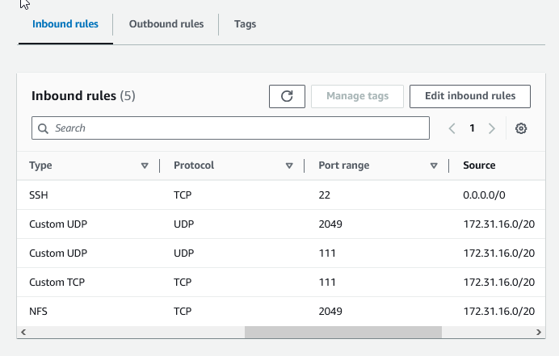

## **2. Configure the Database Server**

### For this section I will :

1. Spin up an EC2 Instance with ubuntu 20.04 

2. Install MySQL Server

3. Create a database named tooling

4. Grant full permission to the user webaccess on tooling database **ONLY** from within the *172.31.16.0/20 Subnet*
 
 
## - Connecting to Server, Updating, Installing MySQL

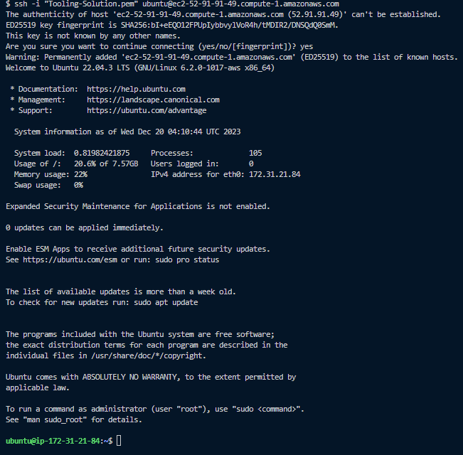

    sudo apt update -y

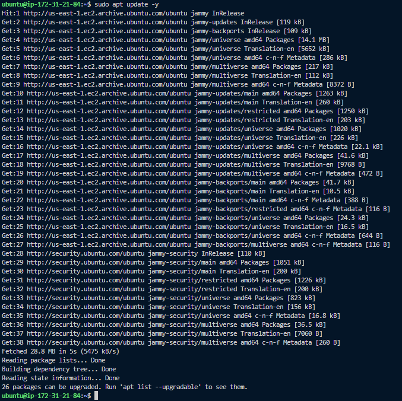

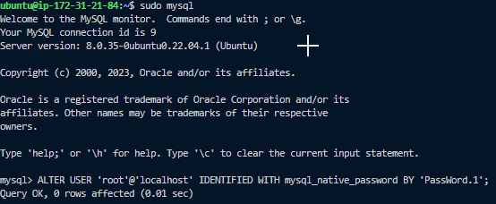

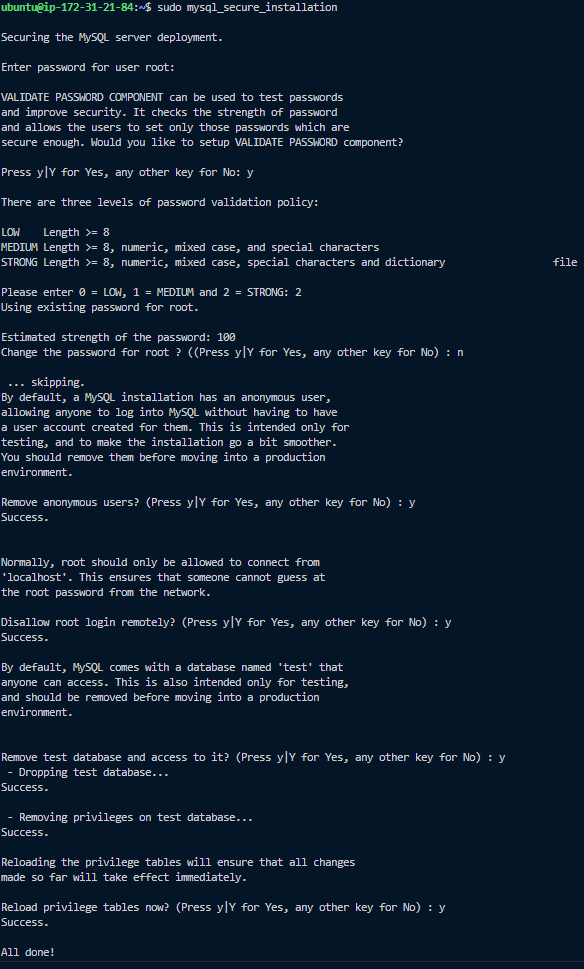

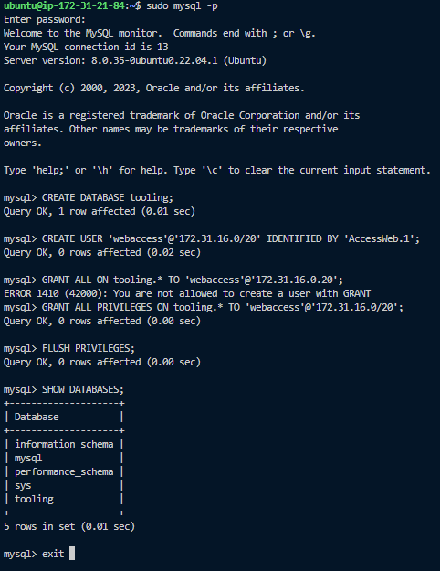

## **Preparing the Wweb Servers**

### I spun up 3 EC2 Instances with Rhel 8 Operating systems

During the next steps I will :

- Configure NFS Client (on all 3 webservers)

Beyond this I have no idea what happened nothi9ong I or the support staff @ DAREY.IO could help me get to a solution

Here are the screenshots of what i have done::

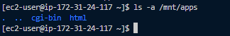

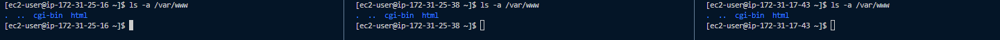

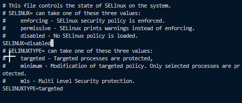

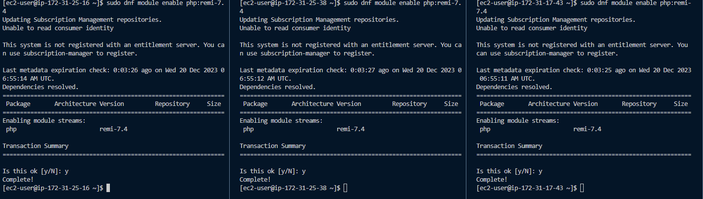
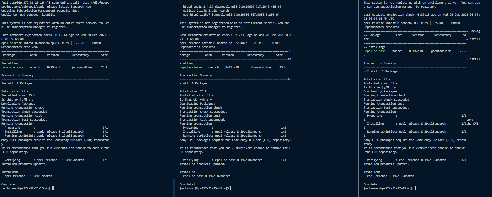
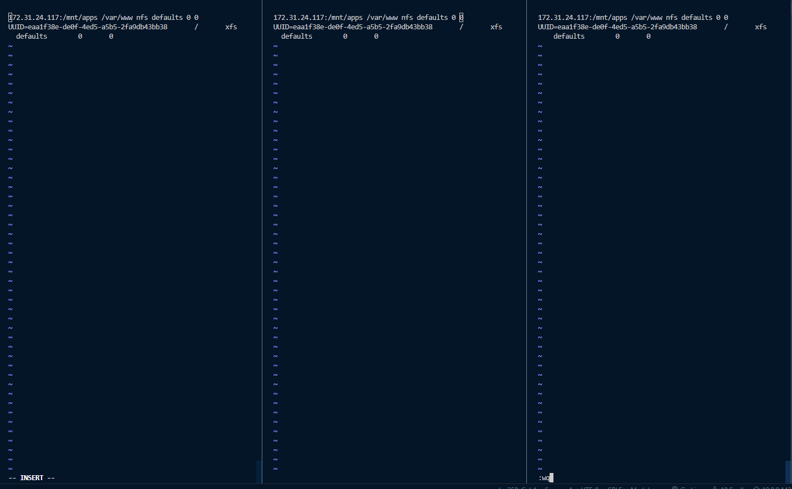
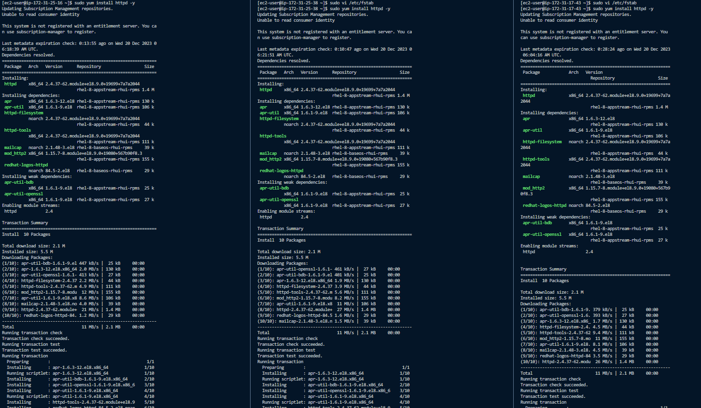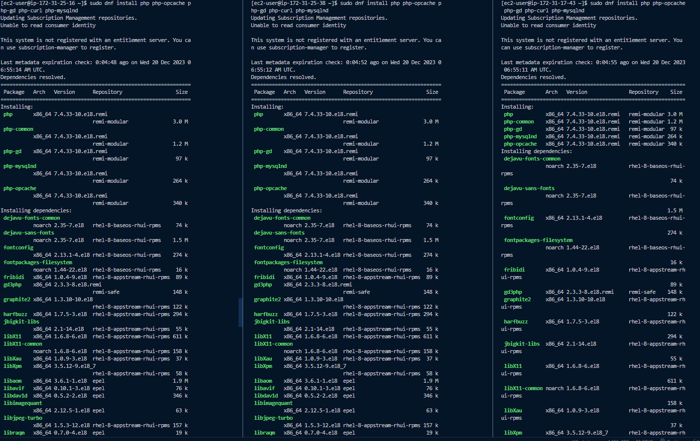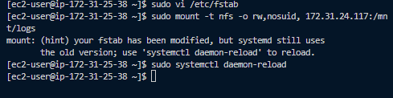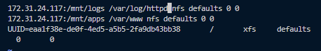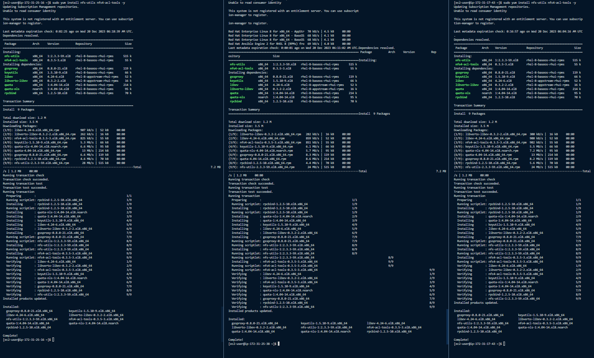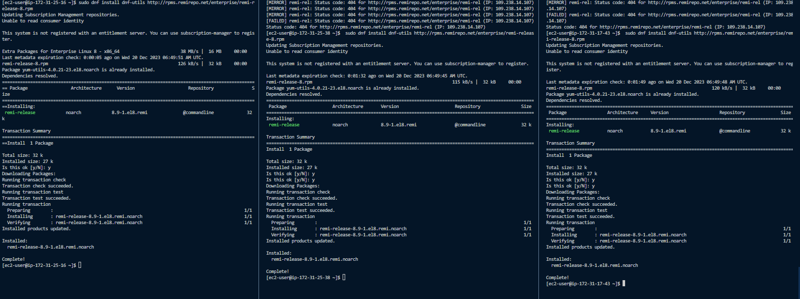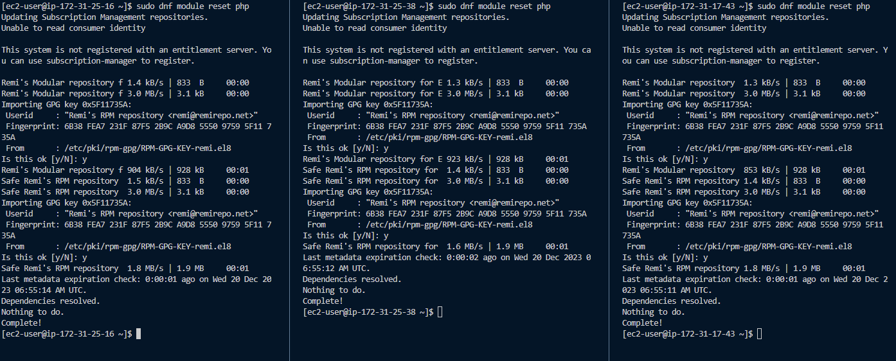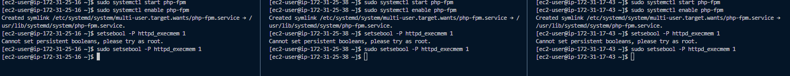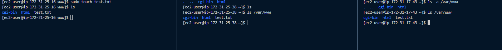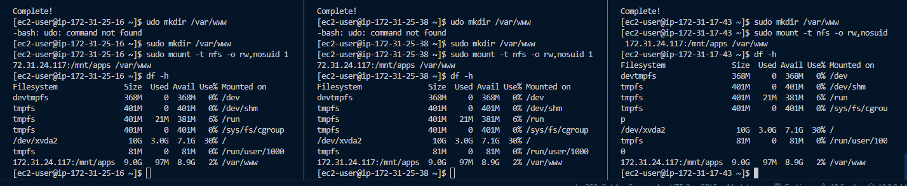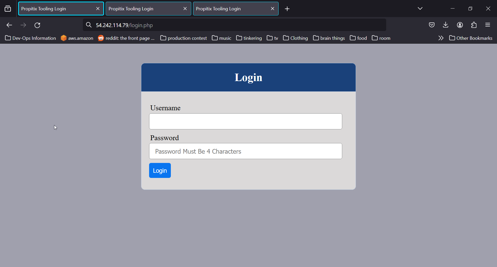