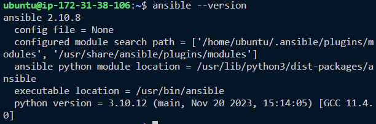

# **Ansible Automate Project**

In this project I will demonstrate how to automate routine tasks by using Ansible Configuration Management. I will also be writing code using declarative languages such as YAML.

A Jump (Bastian Host) Server acts as an intermediary server in which access to the internal network can be provided, this provides better security.

## **Install and Configuration of Ansible**

1. I spun up an ubuntu EC2 Instance named Jenkins-Ansible

            This will be used to run playbooks

    

    

    

2. I created a new repo in my GitHub and named it  ansible-config-mgt

3. Ansible was installed on the Jenkins-Ansible EC2 Instance

4. Jenkins build jobs was configured to archive the repo content with every change

    -
    -
    -

5. The previous setup was tested by making a change to the README.md file in the main branch

